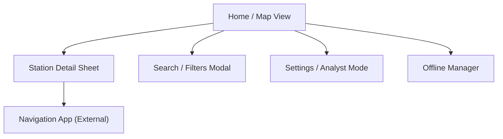

# UX Design Document : FaisTonPlein

**Date :** 09/03/2026
**Auteur :** Baptiste (UX Designer & BMAD)
**Statut :** Draft
**Version :** 1.1 (Correction Mermaid & Wireframes)
**Source :** [PRD](../planning/prd-faistonplein.md)

***

## 1. Vue d'ensemble (Overview)

**FaisTonPlein** est une application "Mobile-First" (PWA) conçue pour la rapidité et la clarté. L'expérience utilisateur doit être fluide, même en conditions de réseau dégradées.

**Principes UX Clés :**

1. **Immédiateté :** L'information cruciale (prix le moins cher autour de moi) doit être visible en < 3 secondes.
2. **Transparence :** Les coûts réels (plein complet) sont mis en avant.
3. **Progressive Disclosure :** L'interface par défaut est simple; les outils d'analyse sont activables à la demande.
4. **Resilience :** L'état "Hors-ligne" doit être clairement indiqué mais non bloquant.

***

## 2. Architecture de l'Information (Sitemap)

L'application est structurée autour d'une vue principale hybride (Carte/Liste) pour minimiser la navigation.



***

## 3. Parcours Utilisateurs (User Flows)

### 3.1 Flow "Urgentiste" (Samia)

_Objectif : Trouver de l'essence immédiatement._

1. **Ouverture App** : Chargement rapide, demande géolocalisation.
2. **Vue Carte** : Centrée sur position, stations proches affichées avec prix.
3. **Sélection** : Tap sur le pin le plus proche (ou le moins cher).
4. **Action** : Tap sur "Y aller" -> Ouvre Waze/Google Maps.

### 3.2 Flow "Économe" (Jean-Pierre)

_Objectif : Minimiser le coût total._

1. **Ouverture App** : Vue liste (préférence utilisateur).
2. **Filtre** : Vérification carburant (ex: Diesel).
3. **Configuration** : Saisie capacité réservoir (ex: 50L) dans les filtres.
4. **Comparaison** : La liste affiche "85€" (Total) au lieu du prix au litre.
5. **Décision** : Choix de la station avec le meilleur compromis Prix/Distance.

### 3.3 Flow "Analyste" (Alex)

_Objectif : Comprendre les tendances._

1. **Toggle Mode** : Activation "Mode Analyste" dans les réglages rapides.
2. **Exploration** : Les pins sur la carte changent de couleur (Vert=Baisse, Rouge=Hausse).
3. **Détail Station** : Ouverture fiche station -> Affichage graphique historique 30j.

***

## 4. Wireframes (Low-Fidelity)

### 4.1 Vue Principale (Full-Screen Map)

```text
+-------------------------------------+
|  [ SEARCH BAR (Nominatim API)    ]  |  <-- Floating Command Menu (Top)
|  [ (o) SP98  ( ) E10  ( ) Diesel ]  |  <-- Scrollable Badges
|                                     |
|          ( CARTE INTERACTIVE )      |
|                                     |
|      [1.85€]  <-- PriceMarker       |
|                  [1.79€]            |
|          (You)                      |
|                                     |
|                                     |
|                                [⚙]  |  <-- Floating Action Buttons
|                                [≣]  |      (Settings / List)
+-------------------------------------+
|  ____                               |  <-- Bottom Drawer (Vaul)
|  Total Access Relais   (2.5 km)     |
|  SP98: 1.85€  |  E10: 1.79€         |
|  [ Y Aller ]         [ Détails ]    |
+-------------------------------------+
```

### 4.2 Vue Liste (Alternative)

```text
+-------------------------------------+
|  < Map       Liste Stations  [Filt] |
+-------------------------------------+
|  Trier par : [Prix] [Dist] [Total]  |
+-------------------------------------+
|  1. Leclerc Auto            1.2 km  |
|  Gazole : 1.65 €/L                  |
|  Plein (50L) : 82.50 €      [ > ]   |
+-------------------------------------+
|  2. Total Access            0.5 km  |
|  Gazole : 1.72 €/L  (+0.05)         |
|  Plein (50L) : 86.00 €      [ > ]   |
|  ! Tendance Hausse                  |
+-------------------------------------+
|  3. Shell                   5.0 km  |
|  ...                                |
+-------------------------------------+
```

### 4.3 Détail Station (Sheet/Page)

```text
+-------------------------------------+
|  < Retour                           |
+-------------------------------------+
|  Station Total Access               |
|  12 Rue de la Paix, 75000 Paris     |
|  O Ouvert (24/7)                    |
+-------------------------------------+
|  PRIX ACTUELS (Mise à jour: 2h)     |
|  * SP98   : 1.92 €/L                |
|  * E10    : 1.85 €/L   (\ -2cts)    |
|  * Diesel : 1.75 €/L                |
+-------------------------------------+
|  SERVICES                           |
|  [Gonflage] [Lavage] [Boutique]     |
+-------------------------------------+
|  HISTORIQUE (Mode Analyste ON)      |
|  |       .                          |
|  |     .   .                        |
|  |   .       .                      |
|  | .           .                    |
|  +------------------ (30j)          |
+-------------------------------------+
|       [ ITINÉRAIRE (Waze) ]         |
+-------------------------------------+
```

### 4.4 Filtres & Réglages

```text
+-------------------------------------+
|  Filtres & Préférences          [X] |
+-------------------------------------+
|  CARBURANT PRÉFÉRÉ                  |
|  ( ) SP98    (o) E10    ( ) Diesel  |
|  ( ) E85     ( ) GPL                |
+-------------------------------------+
|  CALCULATEUR "VRAI COÛT"            |
|  Capacité Réservoir : [ 50 ] Litres |
|  Conso. Véhicule :    [ 6.5] L/100  |
+-------------------------------------+
|  DONNÉES HORS-LIGNE                 |
|  Département : [ 75 - Paris ]       |
|  [ Télécharger (15 Mo) ]            |
|  Dernière màj : 09/03/2026          |
+-------------------------------------+
```

***

## 5. Système de Design (Design System)

Basé sur **Shadcn UI** et **Tailwind CSS**.

### 5.1 Couleurs (Palette : "Electric Asphalt")

- **Base (Neutrals) :** `Slate` (Gris bleuté). Plus "technique" et profond que le Zinc standard.
  - *Light Mode :* Fond `Slate-50` / Surface `White`.
  - *Dark Mode :* Fond `Slate-950` / Surface `Slate-900`.
- **Primary :** `Indigo-600` (Dark: `Indigo-500`).
  - Une couleur vibrante et moderne qui se démarque des applications utilitaires bleues ou oranges.
- **Semantic :**
  - `Emerald-500` : Bon prix / Économie (Plus vif que Green).
  - `Rose-500` : Prix cher / Hausse (Plus doux que Red).
  - `Amber-400` : Attention / Obsolète.

### 5.2 Typographie (Theme : "Modern Dashboard")

- **Headings :** `Space Grotesk` (Google Font).
  - Une police "Display" avec des traits techniques et carrés, rappelant les tableaux de bord modernes.
- **Body & UI :** `Manrope` (Google Font).
  - Choisie spécifiquement pour ses **chiffres tabulaires** (parfaits pour aligner les prix) et sa lisibilité exceptionnelle sur mobile.
- **Styles :**
  - **H1 :** Space Grotesk Bold 24px.
  - **Price (Big) :** Manrope ExtraBold 32px (Tracking tight).
  - **Label :** Manrope Medium 12px (Uppercase, tracking wide).

### 5.3 Composants Clés (Shadcn)

- `Sheet` : Pour le détail station et les filtres (Mobile friendly).
- `Card` : Pour les items de liste.
- `Badge` : Pour les types de carburant et statuts.
- `Slider` : Pour le rayon de recherche.
- `Switch` : Pour le Mode Analyste.

***

## 6. Accessibilité (A11y)

- **Contraste :** Vérifier ratio 4.5:1 sur les prix (Texte coloré).
- **Touch Targets :** Boutons min 44x44px pour usage facile en voiture (à l'arrêt !).
- **Screen Readers :** Labels ARIA sur les boutons icones (Filtres, Map toggle).
- **Map Alternatives :** Toujours proposer une vue Liste complète comme alternative à la Carte pour l'accessibilité visuelle.
- **Dark Mode :** Support natif pour réduire l'éblouissement en conduite de nuit.

***

## 7. Prochaines Étapes

1. Validation des wireframes avec l'équipe (PM/Dev).
2. Création des maquettes High-Fidelity (Figma/Code).
3. Implémentation du squelette UI (Shadcn + Layouts).

